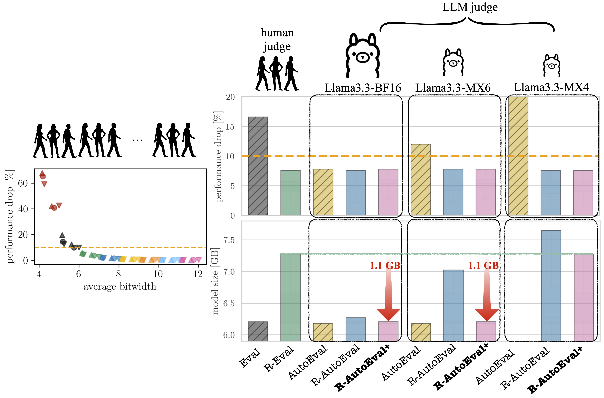

## R-AutoEval+

This repository contains code for **Adaptive Prediction-Powered AutoEval with Reliability and Efficiency Guarantees**.

  

*Figure: How to select the lightest quantized LLM that guarantees up to 10% performance drop as compared to the unquantized version? (see Fig. 1 of the paper for details)*

### Basic Usage

- The file `testing_by_betting.py` implements Algorithm 1 (R-AutoEval+), which reduces to R-Eval and R-AutoEval by setting the argument *rhos* (candidate factors on the reliance to the synthetic data) to [0] and [1]:

### Toy Example
    
-  The folder `runs/toy` contains all the shell scripts to reproduce all the results related to Examples 1 and 2.

### LLM Quantization
    
-  The folder `runs/LLM_quantization` contains all the shell scripts to reproduce all the results related to LLM quantization experiments.

### LLM Prompting
    
-  The folder `runs/LLM_prompting` contains all the shell scripts to reproduce all the results related to LLM prompting experiments.

### Notations

- In the codes, we consider the following schemes 'LTT', 'PPLTT1', 'PPLTT++10','val_true', and 'val_fake'. 'LTT' corresponds to R-Eval applied to model selection where we took the name from the original work https://arxiv.org/abs/2110.01052; 'PPLTT1' corresponds to R-AutoEval where we took the suffix from the original PPI work https://arxiv.org/abs/2301.09633 (note that the last number corresponds to the *fixed* reliance factor which is set to 1 throughout the whole experiments). 'PPLTT++10' corresponds to R-AutoEval+ where the last number indicates the number of candidate reliance factors, $S$. Lastly, 'val_true' and 'val_fake' correspond to Eval and AutoEval which treat the empirical mean as the true mean.

### Dependencies 

- All the runnings above do not require any GPUs (nor running LLMs), since all the essential information is extracted in the *loss table* that admits the shape of (number of candidate models, total number of examples), where the $(i,j)$-th element represents the loss of $i$-th candidate model evaluated on the $j$-th example. Two types of loss tables are saved in each folder, one is using the real-world data and the other is using the synthetic data generated by the larger LLMs (autoevaluators) of different qualities. 

### Raw Data

- If you want to check the raw data from LLMs, then the `/dataset` folder might be useful.
